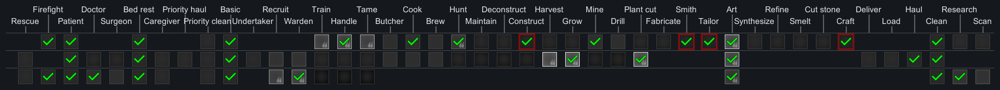
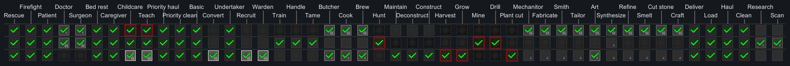

# Many Jobs

[%5D&label=Built%20for%20RimWorld&style=for-the-badge)](https://rimworldgame.com/)
&emsp;

&emsp;

&emsp;

Many Jobs is a [mod](https://rimworldwiki.com/wiki/Mods) for the [Ludeon Studios](https://ludeon.com/) game [RimWorld](https://rimworldgame.com/). Please see the [Acknowledgments section](#acknowledgments) below for important information.

## Description

I've always had a love-hate relationship with RimWorld's Work tab. Getting pawns to do _what_ you _when_ you want them to do it has been the source of a lot of frustration for me. Now, there's an argument to be made that that's part of the challenge of the game. If so, then it's a part of the game that _I don't particularly enjoy,_ so I decided to do something about it.

## Work Types

With Many Jobs installed, RimWorld's work types look like this:

| Work&nbsp;Type | Description |
|:---------------|:------------|
| Rescue | Rescue downed allies and take them to medical beds. |
| Firefight | Fight fires in the home area. |
| Patient | Go to a medical bed for treatment. |
| Doctor | Tend to patients, oneself and animals, in that order. |
| Surgeon | Perform operations on humanlikes and animals. |
| Bed Rest | Rest and recuperate in bed. |
| Caregiver | Feed patients, prisoners and animals; visit the sick to cheer them up. |
| Priority Haul | Do important hauling jobs. |
| Priority Clean | Do important cleaning jobs. |
| Basic | The standard work type for unskilled and simple tasks. |
| Undertaker | Strip, haul and cremate corpses. |
| Recruit | Recruit prisoners. |
| Warden | Generally handle prisoners. |
| Train | Train colony animals. |
| Handle | Handle colony animals, including roping them, slaughtering them and harvesting their resources. |
| Tame | Tame wild animals. |
| Butcher | Butcher creatures. |
| Cook | Prepare meals. |
| Brew | Brew drinks. |
| Hunt | Hunt down and kill animals that are designated to be hunted. |
| Maintain | Fix broken-down buildings and repair things. |
| Deconstruct | Uninstall and deconstruct things. |
| Construct | Build things and structures. |
| Harvest | Harvest crops. |
| Grow | Plant crops. |
| Mine | Dig. |
| Drill | Operate deep drills. |
| Plant cut | Cut plants and extract trees. |
| Fabricate | Do jobs at fabrication benches. |
| Smith | Make things at smithies or machining tables. |
| Tailor | Make things at tailor benches. |
| Art | Paint things and make art. |
| Synthesize | Synthesize drugs at drug labs. |
| Refine | Operate biofuel refineries. |
| Smelt | Do bills at smelters. |
| Cut stone | Do bills at stonecutting tables. |
| Craft | Make things at crafting spots. |
| Deliver | Deliver construction materials to where they're needed. |
| Load | Load and unload caravans and transport pods. |
| Haul | Do general hauling jobs. |
| Clean | Do general cleaning jobs. |
| Research | Do research at research benches. |
| Scan | Operate long-range and ground-penetrating scanners. |

In general, jobs that depend on a skill have been separated from jobs that don't especially depend on that skill. For example, harvesting crops and wild plants is highly dependent on a pawn's Plants skill; low Plants skill can result in a botched harvest and loss of product. But when it comes to sowing crops, a pawn's Plants skill only affects the speed at which that pawn works. So if you're training up a pawn to be a farmer, maybe you want to enable Grow on that pawn but only enable Harvest on your highest-skilled pawn.

Also, I've made a concerted effort to put work types in a sensible order of priority. Rescuing injured pawns is the highest-priority work type because when a pawn's bleeding heavily seconds count. The Undertaker work type, which consists of jobs that in vanilla RimWorld are way down in the Haul category, is relatively high up so your pawns don't leave dead bodies out in the sun indefinitely to rot and stink up the place.

# DLC

Many Jobs is compatible with and supports the Royalty, Ideology and Biotech DLCs and their new features.

## Royalty

Royalty doesn't add any new workgivers or worktypes to the game, so Many Jobs "just works" with it.

## Ideology

With Ideology installed you get:

| Work&nbsp;Type | Description |
|:---------------|:------------|
| Convert | Convert prisoners to an ideoligion. |

## Biotech

Biotech adds children and their care and mechanoids and _their_ care.

| Work&nbsp;Type | Description |
|:---------------|:------------|
| Teach | Teach lessons to children in a classroom. |
| Mechanitor | Use the Subcore Encoder, gestate mechanoids, repair mechs and do related tasks. |

# Mod Support

Many Jobs patches the following mods to make the Work tab nicer:

- [Dubs Bad Hygiene](https://steamcommunity.com/sharedfiles/filedetails/?id=836308268)
  - washing patients, cleaning bedpans and administering fluids to the sick is now a Caregiver job
  - clearing blocked drains is under Maintain
  - loading and unloading washing machines and composters is part of Priority Haul
  - refilling water containers is also part of Priority Haul
  - emptying septic tanks is a Basic job
- [Fluffy Breakdowns](https://steamcommunity.com/sharedfiles/filedetails/?id=726244033)
  - this mod's maintenance job is part of Maintain
- [Fluffy's Colony Manager](https://steamcommunity.com/sharedfiles/filedetails/?id=715565262)
  - the management job has been moved _way_ up in the priority list, now falling between Basic and Undertaker
- [Vanilla Expanded Framework](https://steamcommunity.com/sharedfiles/filedetails/?id=2023507013)
- [Vanilla Books Expanded](https://steamcommunity.com/sharedfiles/filedetails/?id=2193152410)
- [Vanilla Fishing Expanded](https://steamcommunity.com/sharedfiles/filedetails/?id=1914064942)
- [Vanilla Furniture Expanded - Security](https://steamcommunity.com/sharedfiles/filedetails/?id=1845154007)
- [Allow Tool](https://steamcommunity.com/sharedfiles/filedetails/?id=761421485)

# Strong Recommendations

- [Work Tab](https://steamcommunity.com/sharedfiles/filedetails/?id=725219116)
- [Grouped Pawns Lists](https://steamcommunity.com/sharedfiles/filedetails/?id=2340773428)

These two mods together dramatically improve the Work tab user interface. I use them and you should too.

# Incompatibilities

Many Jobs is not generally compatible with any other mod that does the same basic thing:

- [[FSF] Complex Jobs](https://steamcommunity.com/sharedfiles/filedetails/?id=2069684319)
- [Job Splitter](https://steamcommunity.com/sharedfiles/filedetails/?id=1211661009)
- [Nurse Job](https://steamcommunity.com/sharedfiles/filedetails/?id=1820501433)

Trying to run Many Jobs with one of these other mods will have surprising results.

# FAQ

### Can I add this mod to a save game?

Yes. In technical terms, Many Jobs neither creates nor removes any work types or work givers; it just rearranges their relationships. It should be no problem to add Many Jobs to a game already in progress.

### Can I remove this mod from a save game?

It's generally not a good idea to remove mods in the middle of a game. That being said, it should be safe to remove Many Jobs. You'll have to redo all your Work tab settings after you do. To emphasize, though, removing Many Jobs mid-game _is not supported._ If doing it breaks your game, you're on your own.

### Can I use this with [some other mod]?

Generally yes. Mods broadly fall into two categories: those that add new work types or work givers and those that don't. Most mods don't. Those ones are almost certain to be totally compatible with Many Jobs. Mods that do create new work types or work givers are also almost certain to be compatible, but strange things might happen, like the Work tab not being quite as perfectly organized as you'd like it to be.

### Will you add support for [some other mod]?

Sure, if I can. Send me a message telling me about the mod you want supported and I'll give it my best shot.

### CE?

Probably? I really don't know. Try it and report back.

# Acknowledgments

This mod has been _heavily_ inspired by the work of other modders. I mention in particular FrozenSnowFox's [Complex Jobs](https://steamcommunity.com/sharedfiles/filedetails/?id=2069684319) mod, which I used for a long time before deciding to do my own thing. If you don't like my mod, I wholeheartedly recommend you try his.

Portions of the materials used to create this mod are trademarks and/or copyrighted works of Ludeon Studios Inc. All rights reserved by Ludeon. This content/mod is not official and is not endorsed by Ludeon.
